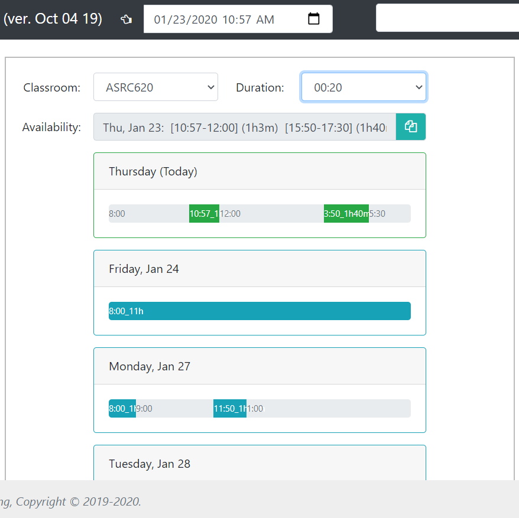
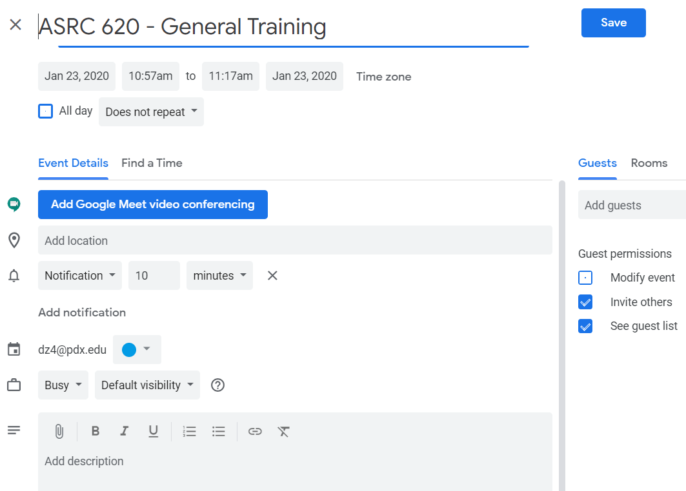
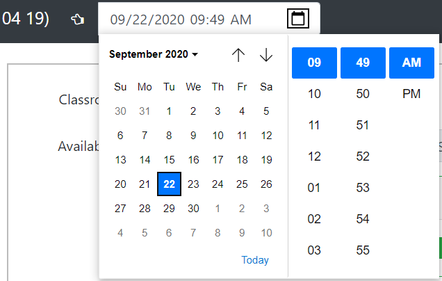

# An internal tool to find next classroom available
https://ddveloper.github.io/TimeAvailable/

# Introduction

## Load csv file to view available classroom time slots

## Click on any available slot to schedule a meeting with instructor

## Set start date and time if needed

